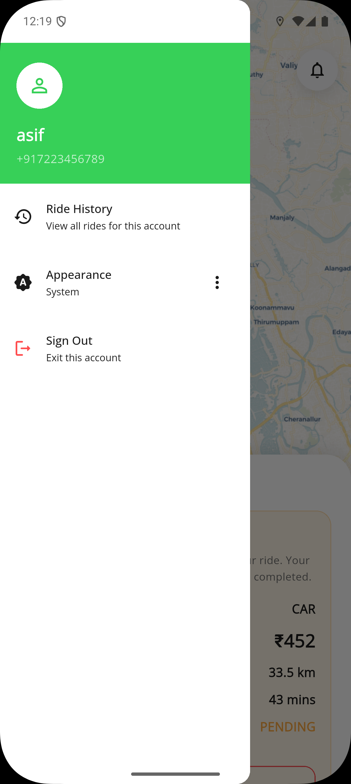

# 🚖 BookMyRide – Full Stack Ride Booking App

BookMyRide is a **Flutter + Firebase powered ride-booking application** that connects users and drivers in real-time.  
It follows a **Feature-first Clean Architecture** approach and uses **Redux for state management**, ensuring scalability and maintainability.

---

## ✨ Key Highlights

- 🔐 OTP-based authentication (Phone login)
- 👥 Role-based system (User / Driver)
- 🗺️ OpenStreetMap integration for maps & routing
- 🚕 Real-time ride lifecycle (Pending → Accepted → Completed)
- 📊 Driver earnings dashboard
- 🌙 Light & Dark theme support
- 🧱 Feature-first Clean Architecture
- 🔁 Redux state management

---

## 📱 App Screens

### 🔐 Authentication
<p align="center">
  
  
  
</p>

---

### 👤 Onboarding & Role Selection
<p align="center">
  
  
  
</p>

---

### 🧑 User Flow
<p align="center">
  
  
  
  
</p>

---

### 🚗 Driver Flow
<p align="center">
  
  
  
</p>

---

### ⚙️ Drawer & Settings
<p align="center">
  
</p>

---

## 🏗️ Architecture

This project follows a **Feature-first Clean Architecture**, where each feature is modular and self-contained.

### 📦 Structure
lib/
├── core/ # Shared utilities, constants, services
├── features/
│ ├── auth/ # Authentication (OTP login)
│ ├── user/ # User ride booking flow
│ ├── driver/ # Driver ride handling
│ ├── ride/ # Ride lifecycle management


### 🧱 Layers

- **Presentation Layer** → UI & Widgets  
- **Domain Layer** → Business logic & entities  
- **Data Layer** → Firebase integration & APIs  

---

## 🔁 State Management (Redux)

- Centralized global state using **Redux**
- Predictable state updates using:
  - Actions
  - Reducers
  - Store
- Efficient handling of:
  - Authentication state
  - Ride status updates
  - User & driver data

---

## 🔄 Ride Lifecycle

- 🟡 **Pending** – Created by user  
- 🔵 **Accepted** – Accepted by driver  
- 🟢 **Completed** – Ride finished  

---

## 🛠️ Tech Stack

- **Frontend:** Flutter  
- **Backend:** Firebase (Authentication + Firestore)  
- **State Management:** Redux  
- **Architecture:** Feature-first Clean Architecture  

### 🌍 Maps & Location
- OpenStreetMap  
- OpenRouteService  
- Photon API (Place Search)  
- Geolocator  

---

## ⚙️ Installation

```bash
git clone https://github.com/your-username/bookmyride.git
cd bookmyride
flutter pub get
flutter run