

# 🚖 BookMyRide

### 🗺️ Ride • Connect • Travel Smart

---

---

## ✨ About the App

**BookMyRide** is a full-stack ride booking application that connects **users and drivers in real-time**.

It provides a complete ride experience from **booking → acceptance → completion**, powered by maps, location tracking, and real-time updates.

Built with:
- 🧱 Feature-first Clean Architecture  
- 🔁 Riverpod state management  
- ⚡ Scalable and maintainable structure  

---

## 🚀 Features

### 🔐 Authentication
- Phone number login with OTP
- Secure Firebase authentication

### 👤 User Features
- Live location detection
- Search destination
- Ride fare estimation
- Book rides by vehicle type
- View ride history

### 🚗 Driver Features
- Accept ride requests
- Update ride status
- Track completed rides
- View total earnings

### 🗺️ Maps & Navigation
- OpenStreetMap integration
- Route drawing using polylines
- Distance & time estimation

### 🎨 UI/UX
- Clean modern interface
- Dark & Light mode support
- Smooth user experience

---

## 📱 Screenshots

### 🔐 Authentication

  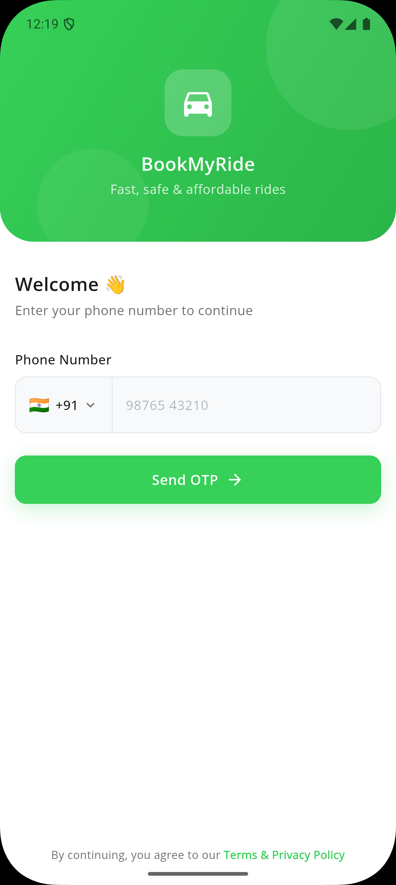
  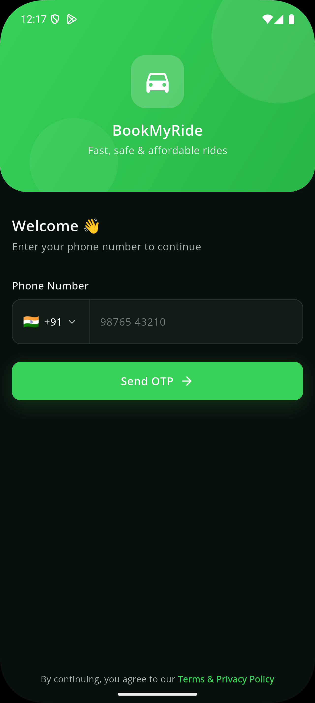
  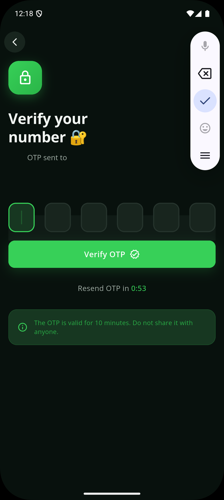

---

### 👤 Onboarding

  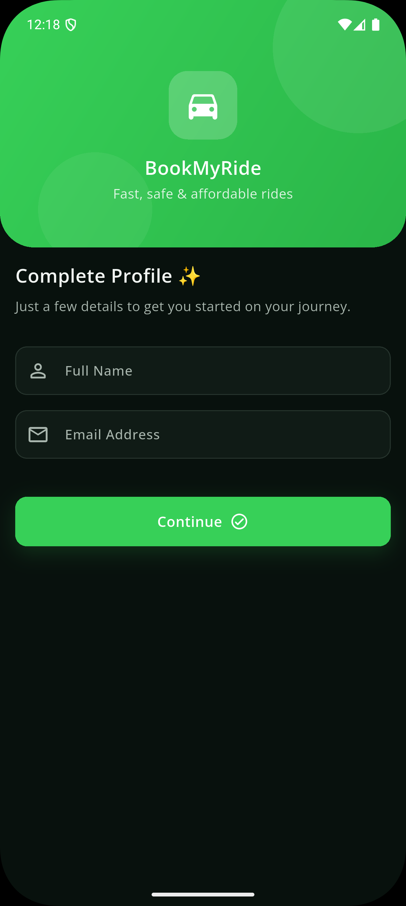
  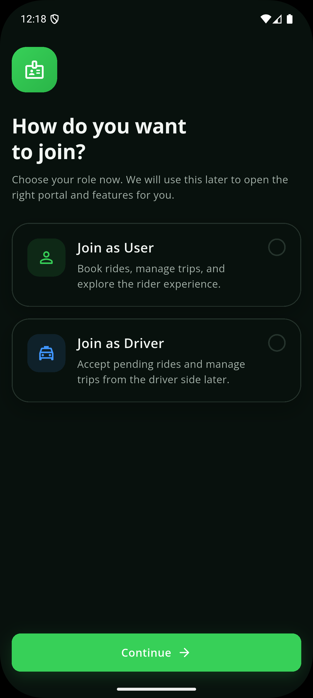
  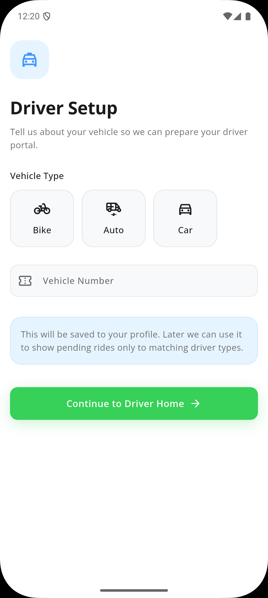

---

### 🧑 User Flow

  
  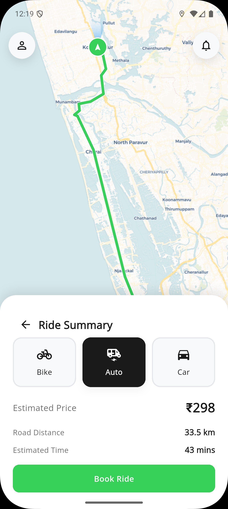
  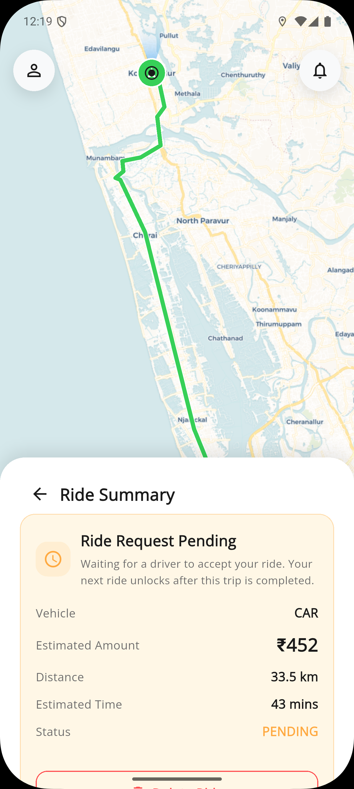
  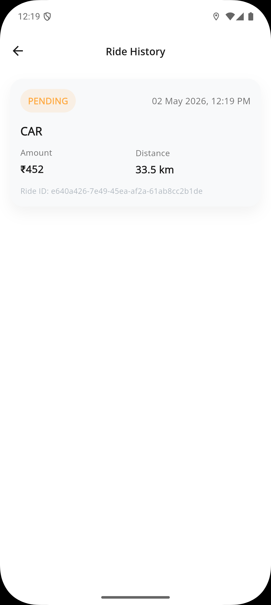

---

### 🚗 Driver Flow

  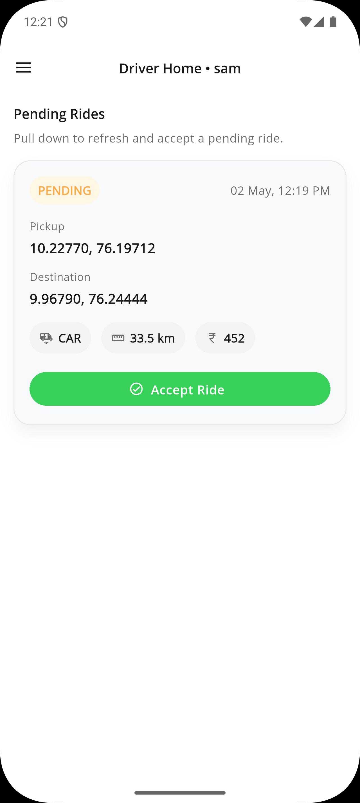
  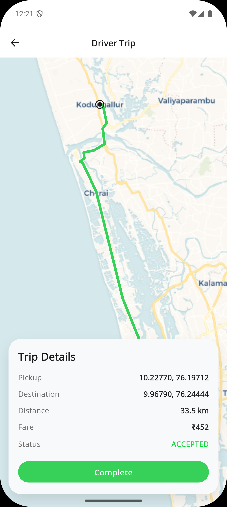
  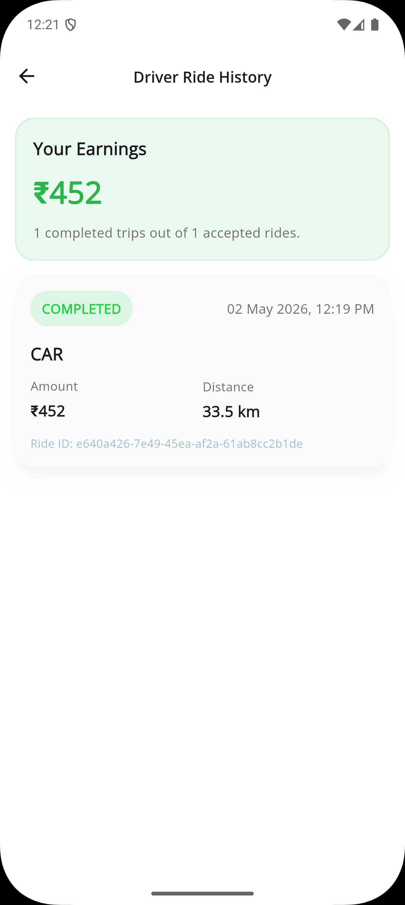

---

## 🧠 Architecture

**Feature-First Clean Architecture + Riverpod**

### 📦 Project Structure

lib/
├── core/  
├── features/  
│   ├── auth/  
│   │   ├── data/  
│   │   ├── domain/  
│   │   └── presentation/  
│  
│   ├── driver/  
│   │   ├── data/  
│   │   ├── domain/  
│   │   └── presentation/  
│  
│   ├── home/  
│   ├── maps/  
│   ├── pending_rides/  
│   ├── polylines_routes/  
│   ├── ride/  
│   ├── shared/  
│  
└── main.dart  

---

### 🧱 Architecture Layers

- **Presentation Layer** → UI & state handling  
- **Domain Layer** → Business logic & use cases  
- **Data Layer** → Firebase & API integration  

---

## 🔁 State Management (Riverpod)

- Reactive and scalable state management
- Clean separation of business logic from UI
- Dependency injection support

Used for:
- Authentication state  
- Ride lifecycle updates  
- User & driver data  

---

## 🔄 Ride Lifecycle

- 🟡 Pending → Created by user  
- 🔵 Accepted → Accepted by driver  
- 🟢 Completed → Ride finished  

---

## 🛠️ Tech Stack

| Tech              | Usage                |
|------------------|---------------------|
| Flutter          | UI Development       |
| Firebase Auth    | Authentication       |
| Firestore        | Database             |
| Riverpod         | State Management     |
| OpenStreetMap    | Maps                 |
| OpenRouteService | Routing              |
| Photon API       | Place Search         |

---

## ⚙️ Getting Started

### 1. Clone the repository
git clone https://github.com/your-username/bookmyride.git  
cd bookmyride  

### 2. Install dependencies
flutter pub get  

### 3. Run the app
flutter run  

---

## 🔐 Configuration

- Add Firebase configuration files:
  - google-services.json  
  - GoogleService-Info.plist  
- Enable Phone Authentication  
- Configure routing & search APIs  

---

## 🚀 Future Improvements

- 📍 Real-time driver tracking  
- 💬 In-app chat  
- 💳 Payment integration  
- 🔔 Push notifications  
- ❌ Ride cancellation  
- 🧑‍💼 Admin dashboard  

---

## 👨‍💻 Author

**Ebin Antony**

---

## ⭐ Support

If you like this project, give it a ⭐ on GitHub!

---

✨ Built with Flutter & Passion ✨

